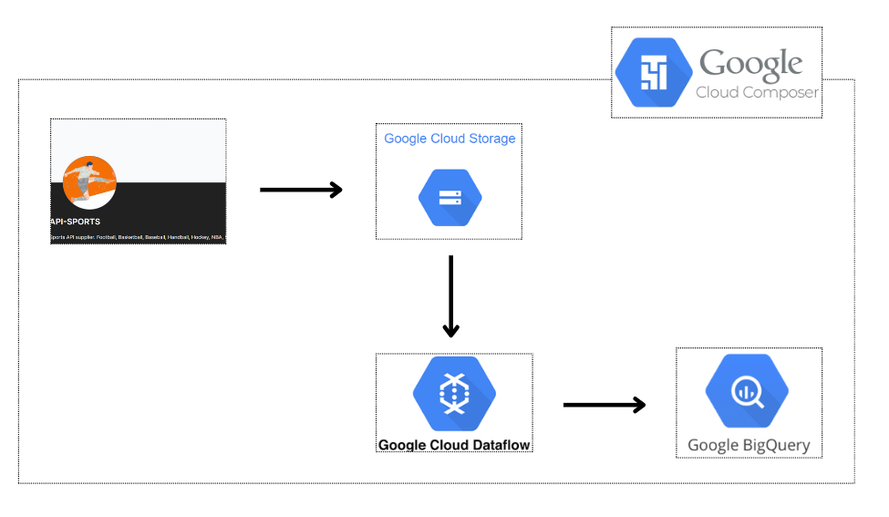

# Sports Data Pipeline

This project sets up a data pipeline that extracts sports data from an API, processes it using Google Cloud services, and stores it in Google BigQuery for analysis. The pipeline is orchestrated using Google Cloud Composer.

## Overview

The pipeline consists of the following steps:

1. **Extract**: Fetch sports data from the API-Sports service.
2. **Load**: Store the extracted data in Google Cloud Storage.
3. **Transform**: Process and transform the data using Google Cloud Dataflow.
4. **Load**: Store the transformed data in Google BigQuery.
5. **Orchestrate**: Manage and automate the pipeline using Google Cloud Composer.

## Architecture

!

### Components

- **API-Sports**: The source of sports data. This API provides information such as football scores, player statistics, team information, etc.
- **Google Cloud Storage**: Used to store raw data files extracted from the API.
- **Google Cloud Dataflow**: Processes and transforms the data stored in Google Cloud Storage. This can include data cleaning, enrichment, and formatting.
- **Google BigQuery**: A fully-managed data warehouse where the processed data is stored for querying and analysis.
- **Google Cloud Composer**: An orchestration tool based on Apache Airflow, used to schedule, monitor, and manage the entire data pipeline.

## Prerequisites

- Google Cloud Project
- API-Sports account with API access
- Google Cloud SDK installed and authenticated
- Python installed
- Apache Beam installed with GCP extras (`pip install apache_beam[gcp]`)

## Setup
- Create resources with terraform
